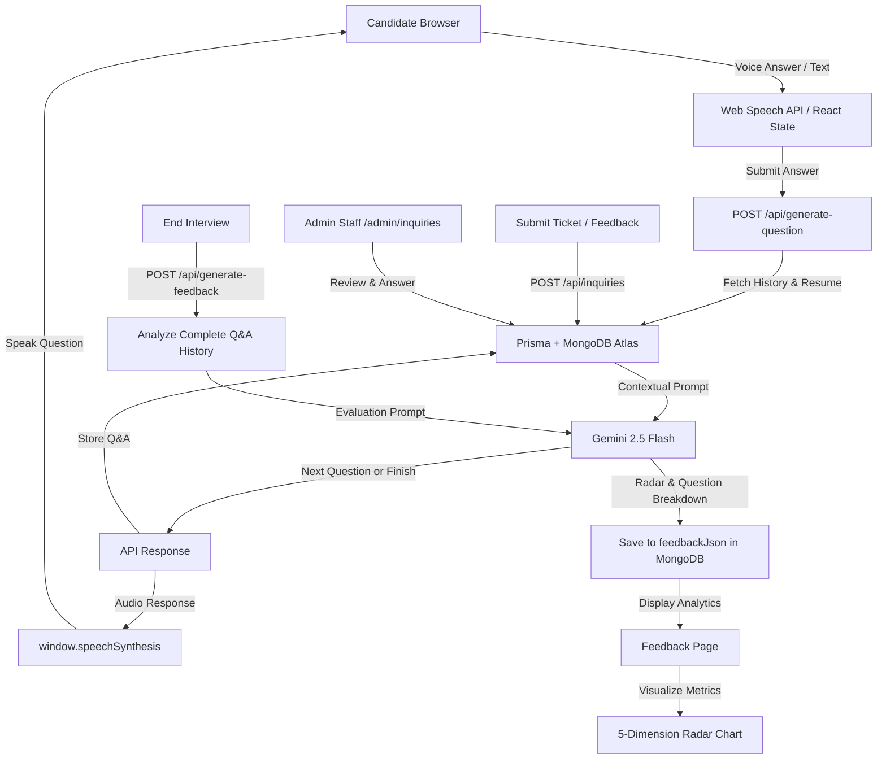
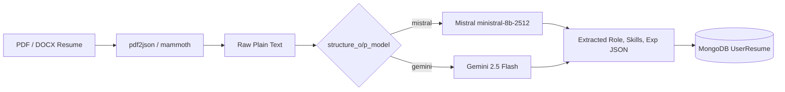
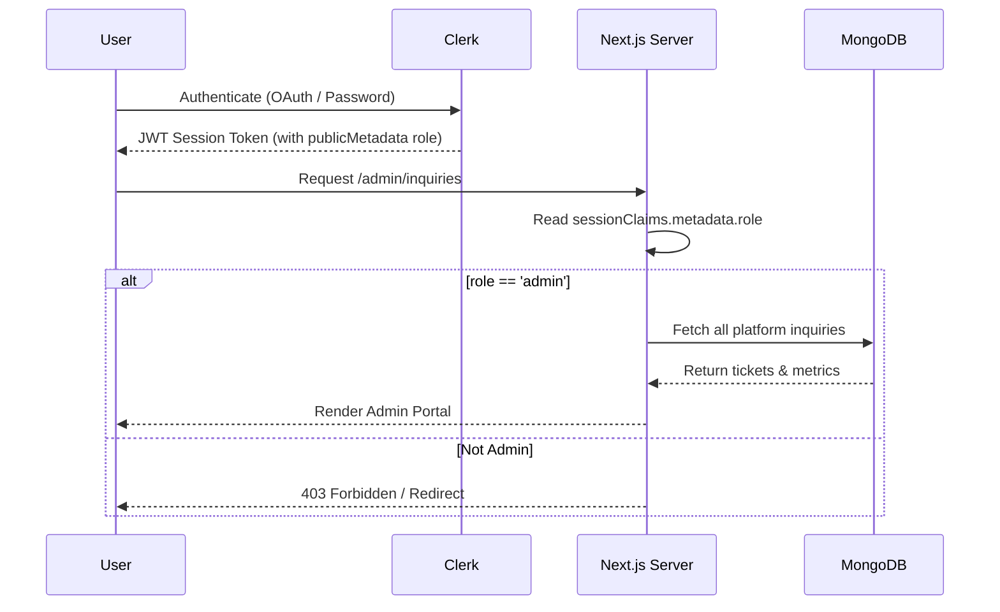
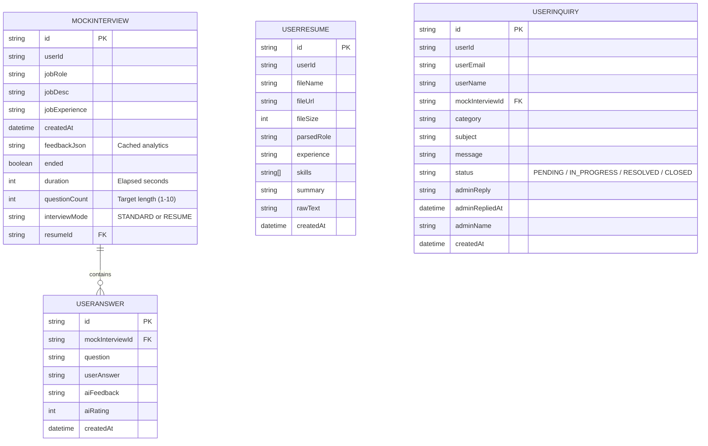

# 🎤 MockMate - AI-Powered Interview Simulator

<div align="center">

[](https://nextjs.org)
[](https://react.dev)
[](https://www.typescriptlang.org)
[](https://prisma.io)
[](https://mongodb.com)
[](LICENSE)

**Transform Your Interview Skills with AI-Powered Practice Sessions**

</div>

---

## 📋 Overview

MockMate is a comprehensive AI-powered interview simulation platform that helps developers practice and perfect their technical interview skills. Powered by Google Gemini AI and Mistral AI, MockMate generates context-aware questions, supports resume-grounded interviews, evaluates responses in real-time, and delivers detailed performance analytics with actionable feedback.

**Key Benefits:**
- 🎯 Practice realistic, role-specific or resume-grounded interview scenarios
- 🤖 Intelligent AI interviewer that adapts to your experience level and conversation flow
- 📄 Resume Upload & Structured Parsing via Mistral (`ministral-8b-2512`) and Gemini
- 🔢 Configurable question count (1 to 10 questions with quick presets)
- 🎥 Webcam & voice integration for immersive practice
- 📊 Detailed post-interview radar analytics and cached performance insights
- 💬 Private 1-to-1 User-to-Admin Support & Inquiry ticket system
- 🛡️ Dedicated Admin Portal with ticket lifecycle management and instant reply composer
- 🔐 Secure Clerk authentication with Role-Based Access Control (RBAC) via session claims

---

## 🛠️ Tech Stack

### Frontend & Backend
| Technology | Purpose | Version |
|-----------|---------|---------|
|  | Full-stack React framework | 16.1.6 |
|  | UI library | 19.2.3 |
|  | Type-safe JavaScript | 5.x |
|  | Styling | 4.x |

### Database & ORM
| Technology | Purpose | Version |
|-----------|---------|---------|
|  | Document Database (Atlas) | 8.x |
|  | Type-safe ORM | 6.19.2 |

### AI & Document Parsing
| Technology | Purpose |
|-----------|---------|
|  | AI interview engine & evaluation (`gemini-2.5-flash`) |
|  | Structured resume entity extraction (`ministral-8b-2512`) |
| `pdf2json` & `mammoth` | Server-side PDF and DOCX binary parsing |
|  | Speech-to-text & text-to-speech |
|  | Voice input wrapper |

### Authentication & UI
| Technology | Purpose | Version |
|-----------|---------|---------|
|  | Authentication & RBAC JWT session claims | 6.38.3 |
|  | UI components | - |
|  | Data visualization | 3.7.0 |
|  | Modern icon library | 0.575.0 |

---

## ✨ Core Features

### 🎙️ Intelligent Adaptive Interview Engine
- **Dynamic Question Generation**: AI generates context-aware follow-up questions adapted to role, experience, and conversation history.
- **Configurable Question Count (1 to 10 Questions)**: Choose custom interview duration with one-click presets (3, 5, 7, 10 Qs) instead of fixed sessions.
- **State & Duration Management**: Preserves chat history in MongoDB and tracks precise interview elapsed time (HH:MM:SS) with session locking upon completion.

### 📄 Resume Grounding & Multi-Model Parser
- **Multi-Resume Support**: Candidates can upload, store, and manage multiple resumes (PDF and DOCX formats).
- **Dual-Model Parsing Router**: Flexible entity extraction using Mistral (`ministral-8b-2512`) or Google Gemini via `structure_o/p_model`.
- **Resume-Grounded Interviews**: Directly bases interview questions on the candidate's actual projects, verified skills, and past experience.

### 📹 Immersive Practice Environment
- **Real-time Voice Input**: Speak answers using the browser's Web Speech API with live audio waveform visualization.
- **AI Speech Synthesis**: AI questions read aloud automatically with browser text-to-speech.
- **Webcam Integration**: Real-time camera feed simulation with privacy toggles.

### 📊 Advanced Analytics & Cached Scoring
- **Radar Chart**: 5-dimension visualization (Technical Accuracy, Communication, Problem Solving, Experience Depth, Confidence).
- **Per-Question Breakdown**: Detailed rating, strengths, weaknesses, and ideal answers for each question.
- **Cached Feedback Scoring**: Post-interview evaluations are stored in database (`feedbackJson`) to eliminate duplicate API calls.

### 📂 5-Panel Candidate Dashboard
- **Interviews**: Complete session logs with role badges and durations.
- **Feedbacks**: Quick cards with overall scores and evaluation links.
- **Analysis**: Historical performance trend area chart.
- **Resume Info**: Uploaded resume library with dates, file sizes, and 5–7 highlighted skills.
- **Support & Inquiries**: Private 1-to-1 helpdesk to submit questions and review admin replies.

### 💬 User-to-Admin Support & Inquiry Ticket System
- **1-to-1 Private Communication**: Candidates can ask questions about evaluations or report bugs.
- **Interview Context Linking**: Inquiries can be linked directly to specific interview sessions.
- **Real-Time Reply Cards**: Candidate dashboard shows official admin response with name and reply timestamp.

### 🛡️ Admin Portal (`/admin/inquiries`)
- **Metric Cards**: Real-time totals for Total Tickets, Pending Review, In Progress, and Resolved.
- **Status Lifecycle Control**: Instant status switcher (`PENDING`, `IN_PROGRESS`, `RESOLVED`, `CLOSED`).
- **Interactive Reply Composer**: Rich reply textarea with canned quick-response template pills.
- **Clerk RBAC Access**: Restricted to authenticated users with `role: "admin"` in Clerk public metadata.

---

## 📁 Project Structure

```
mockmate/
├── 📄 app/                          # Next.js App Router
│   ├── (auth)/                      # Auth routes (sign-in, sign-up)
│   ├── (main)/                      # Main app routes
│   │   ├── admin/                   # Admin Portal
│   │   │   └── inquiries/page.tsx   # Admin Support & Inquiry Management
│   │   ├── dashboard/               # Interview selection & history
│   │   │   └── new/page.tsx         # Setup new interview (Standard & Resume mode)
│   │   ├── interview/[interviewId]/ # Live interview page
│   │   │   └── feedback/            # Post-interview analytics & inquiry trigger
│   │   ├── resume/page.tsx          # Dedicated Resume Upload & Parser page
│   │   └── user-dashboard/page.tsx  # 5-Panel User Dashboard (Interviews, Support, etc.)
│   ├── api/                         # Backend API routes
│   │   ├── admin/inquiries/         # Admin ticket feed, status updates & replies
│   │   ├── generate-feedback/       # POST: AI evaluation & radar scores
│   │   ├── generate-question/       # POST: Adaptive question generation
│   │   ├── inquiries/               # Candidate inquiry submission & inbox
│   │   ├── interview/               # Create, list, end, delete interview sessions
│   │   └── resume/                  # Upload, parse (PDF/DOCX), and manage resumes
│   ├── layout.tsx                   # Root layout
│   └── page.tsx                     # Landing page
│
├── 📦 components/                   # Reusable React components
│   ├── feedback/
│   │   ├── QuestionAccordion.tsx    # Q&A display component
│   │   ├── RadarChartComponent.tsx  # Performance visualization
│   │   └── ScoreCircle.tsx          # Score display
│   ├── inquiry/
│   │   └── SubmitInquiryModal.tsx   # Inquiry / feedback submission modal
│   ├── interview/
│   │   ├── MicButton.tsx            # Voice recording control
│   │   ├── QuestionDisplay.tsx      # Current question display
│   │   ├── SoundWaveAnimation.tsx   # Audio visualization
│   │   └── WebcamView.tsx           # Video stream display
│   ├── ui/                          # Radix UI & Shadcn base components
│   ├── Footer.tsx                   # App footer with resume & support links
│   └── Navbar.tsx                   # Header with role-restricted Admin link
│
├── 🪝 hooks/                        # Custom React hooks
│   └── useSpeechInput.ts            # Voice input management hook
│
├── 📚 lib/                          # Utility & service modules
│   ├── admin.ts                     # Clerk JWT claims admin verification helper
│   ├── gemini.ts                    # Gemini API integration
│   ├── mistral.ts                   # Mistral AI structured parsing client
│   ├── resume-parser.ts             # Multi-model parser router
│   ├── prisma.ts                    # Prisma client instance
│   ├── prompts.ts                   # AI system prompts (custom question count)
│   └── utils.ts                     # Helper utilities
│
├── 🗄️ prisma/                       # Database schema
│   └── schema.prisma                # Prisma data models (MockInterview, UserResume, UserInquiry)
│
├── 🏷️ types/
│   └── globals.d.ts                 # Clerk CustomJwtSessionClaims declaration
│
├── 📋 Configuration Files
│   ├── next.config.ts               # Next.js configuration
│   ├── tsconfig.json                # TypeScript configuration
│   ├── package.json                 # Dependencies & scripts
│   └── eslint.config.mjs            # ESLint rules
```

---

## 🔌 API Documentation

### 🎙️ Interview Management

#### **POST** `/api/interview/create`
Create a new mock interview session (standard role-based or resume-grounded).

**Request:**
```json
{
  "jobRole": "Full Stack Developer",
  "jobDesc": "5+ years experience with React and Node.js...",
  "jobExperience": "5",
  "questionCount": 5,
  "interviewMode": "STANDARD",
  "resumeId": null
}
```

**Response:**
```json
{
  "interviewId": "66ce78a1b2c3d4e5f6789012"
}
```

---

#### **GET** `/api/interview/list`
Fetch all interviews for the authenticated user.

**Response:**
```json
{
  "interviews": [
    {
      "id": "66ce78a1b2c3d4e5f6789012",
      "jobRole": "Full Stack Developer",
      "createdAt": "2026-08-30T10:30:00Z",
      "duration": 345,
      "ended": true,
      "messages": [...],
      "feedbackJson": "{...}"
    }
  ]
}
```

---

#### **GET** `/api/interview/[interviewId]`
Fetch details of a specific interview with full chat history.

**Response:**
```json
{
  "interview": {
    "id": "66ce78a1b2c3d4e5f6789012",
    "jobRole": "Full Stack Developer",
    "jobDesc": "...",
    "jobExperience": "5",
    "questionCount": 5,
    "duration": 345,
    "ended": false,
    "messages": [
      {
        "id": "66ce78b0b2c3d4e5f6789013",
        "question": "Tell me about your experience with React and Node.js.",
        "userAnswer": "I have built full-stack microservices...",
        "aiFeedback": "Clear answer with good depth...",
        "aiRating": 8
      }
    ]
  }
}
```

---

#### **DELETE** `/api/interview/[interviewId]`
Delete an interview session and all associated answer records.

**Response:**
```json
{
  "success": true,
  "message": "Interview deleted successfully"
}
```

---

#### **POST** `/api/interview/[interviewId]/end`
Explicitly end an interview session and store final elapsed duration.

**Request:**
```json
{
  "duration": 420
}
```

**Response:**
```json
{
  "success": true,
  "message": "Interview ended successfully"
}
```

---

### 🤖 AI Question & Feedback Generation

#### **POST** `/api/generate-question`
Generate the next interview question adapted to answers and resume context. Concludes with `[INTERVIEW_COMPLETE]` once target question count is reached.

**Request:**
```json
{
  "interviewId": "66ce78a1b2c3d4e5f6789012",
  "userAnswer": "I implemented Redis caching to lower database query latency."
}
```

**Response:**
```json
{
  "question": "How did you manage cache invalidation strategies across distributed services?",
  "questionCount": 3
}
```

---

#### **POST** `/api/generate-feedback`
Generate comprehensive post-interview feedback and analytics (cached in MongoDB).

**Request:**
```json
{
  "interviewId": "66ce78a1b2c3d4e5f6789012"
}
```

**Response:**
```json
{
  "feedback": {
    "overallScore": 8.2,
    "overallSummary": "Demonstrated strong understanding of distributed systems...",
    "strengths": ["Architecture clarity", "Practical cache invalidation experience"],
    "areasForImprovement": ["Explain trade-offs more explicitly"],
    "radarScores": {
      "technicalAccuracy": 8.5,
      "communication": 8.0,
      "problemSolving": 8.5,
      "experienceDepth": 8.0,
      "confidence": 8.0
    },
    "questionFeedback": [...]
  }
}
```

---

### 📄 Resume Management

#### **POST** `/api/resume/upload`
Upload and parse PDF or DOCX resumes using Mistral (`ministral-8b-2512`) or Gemini.

**Response:**
```json
{
  "success": true,
  "resume": {
    "id": "66ce7901b2c3d4e5f6789014",
    "fileName": "resume.pdf",
    "parsedRole": "Senior Backend Engineer",
    "skills": ["TypeScript", "Node.js", "MongoDB", "Prisma", "Docker"],
    "experience": "4"
  }
}
```

---

#### **GET** `/api/resume`
Fetch all uploaded resumes for the candidate.

---

#### **DELETE** `/api/resume?id=[resumeId]`
Delete a candidate resume.

---

### 💬 Support & Admin Management

#### **POST** `/api/inquiries`
Submit a private candidate inquiry, bug report, or feedback (optionally linked to an interview).

---

#### **GET** `/api/inquiries`
Fetch the authenticated candidate's private submitted inquiries and official admin answers.

---

#### **GET** `/api/admin/inquiries` *(Admin Only)*
Fetch all platform tickets with metrics (`total`, `pending`, `inProgress`, `resolved`), search, and filters.

---

#### **PATCH** `/api/admin/inquiries/[id]/status` *(Admin Only)*
Update ticket status (`PENDING`, `IN_PROGRESS`, `RESOLVED`, `CLOSED`).

---

#### **POST** `/api/admin/inquiries/[id]/reply` *(Admin Only)*
Send official admin reply to candidate and mark ticket `RESOLVED`.

---

## 🏗️ System Architecture

### Data Flow Diagram



### Resume & Multi-Model Parser Architecture



### Role-Based Access Control Flow



---

## 📊 Database Schema

### Entity Relationship Diagram



---

## 🚀 Getting Started

### Prerequisites
- **Node.js** >= 18.0.0
- **npm** or **yarn** package manager
- **MongoDB Atlas** database connection URI
- **Google Gemini API** key
- **Mistral AI API** key *(optional for Mistral resume parsing)*
- **Clerk** authentication keys

### Installation

#### Step 1: Clone Repository
```bash
git clone https://github.com/yourusername/mockmate.git
cd mockmate
```

#### Step 2: Install Dependencies
```bash
npm install
```

#### Step 3: Setup Environment Variables
Create a `.env.local` file in the root directory:

```env
# Clerk Authentication
NEXT_PUBLIC_CLERK_PUBLISHABLE_KEY=your_clerk_publishable_key
CLERK_SECRET_KEY=your_clerk_secret_key

# Database (MongoDB via Prisma)
DATABASE_URL="mongodb+srv://<username>:<password>@<cluster>.mongodb.net/mockmate?retryWrites=true&w=majority"

# AI Model Provider: Google Gemini
GEMINI_API_KEY=your_gemini_api_key
GEMINI_MODEL=gemini-2.5-flash

# AI Model Provider: Mistral AI (Structured Resume Extraction)
MISTRAL_API_KEY=your_mistral_api_key
MISTRAL_MODEL=ministral-8b-2512

# Structured Output Router ("gemini" or "mistral")
structure_o/p_model=mistral
```

> [!TIP]
> **Admin Setup**: In your **Clerk Dashboard** ➔ **Configure** ➔ **Sessions** ➔ **Customize session token**, add `"metadata": "{{user.public_metadata}}"`. Then on your user profile under **Public metadata**, add `{"role": "admin"}` to enable full Admin Portal access.

#### Step 4: Setup Prisma
```bash
# Generate Prisma client
npx prisma generate

# Push schema to MongoDB Atlas
npx prisma db push
```

#### Step 5: Run Development Server
```bash
npm run dev
```

Open [http://localhost:3000](http://localhost:3000) in your browser.

---

## 💻 Usage Guide

### Creating Your First Interview

1. **Sign Up/Login**
   - Navigate to `/auth/sign-up`
   - Create account with email or Google OAuth

2. **Create Interview Session**
   - Go to Dashboard (`/dashboard`)
   - Click "New Interview"
   - Fill in details:
     - **Job Role**: Position you're interviewing for
     - **Job Description**: Copy job posting description
     - **Experience Level**: Years of relevant experience

3. **Practice Interview**
   - Navigate to `/interview/[interviewId]`
   - Allow microphone and camera permissions
   - Read the initial question
   - Click the mic button and speak your answer
   - Submit to receive next question
   - Repeat until interview ends (typically 5 questions)

4. **Review Feedback**
   - After interview ends, view `/interview/[interviewId]/feedback`
   - Analyze:
     - Overall score
     - Radar chart visualization
     - Per-question ratings and feedback
     - Actionable improvement suggestions

### Best Practices

- **Prepare Beforehand**: Have job description ready
- **Treat Seriously**: Practice as if it's a real interview
- **Multiple Sessions**: Conduct multiple practice rounds for same role
- **Study Feedback**: Focus on low-scoring areas
- **Track Progress**: Monitor improvements across sessions

---

## 🔧 Development & Customization

### Modifying AI System Prompts
Edit `lib/prompts.ts` to customize:
- Interview personality and tone
- Question difficulty level
- Feedback depth and specificity

### Adding New UI Components
Use Shadcn/UI to add components:
```bash
npx shadcn-ui@latest add [component-name]
```

### Extending Analytics
Modify `components/feedback/RadarChartComponent.tsx` to:
- Add more evaluation dimensions
- Change visualization type
- Customize metrics calculation

### Database Changes
1. Modify `prisma/schema.prisma`
2. Run: `npx prisma db push`
3. Update API routes accordingly

---

## 🧪 Testing

```bash
# Run linting
npm run lint

# Build for production
npm run build

# Start production server
npm start
```

---

## 🚀 Deployment

### Deploy on Vercel (Recommended)

1. **Push to GitHub**
```bash
git push origin main
```

2. **Connect to Vercel**
   - Go to [vercel.com](https://vercel.com)
   - Click "New Project"
   - Select your repository
   - Add environment variables
   - Deploy

3. **Post-Deployment**
   - Update Clerk OAuth URLs
   - Update Firebase CORS settings
   - Test all features in production

### Alternative Deployment Options
- **Docker**: Create Dockerfile and deploy to any container registry
- **Self-Hosted**: Deploy using PM2 or systemd on any server
- **Netlify**: Deploy frontend separately with serverless functions

---

## 🐛 Known Limitations & Future Improvements

### Current Limitations
- ⚠️ **Browser Voice Limitations**: Web Speech API availability varies by browser (optimal on Google Chrome & Microsoft Edge).
- ⚠️ **AI Quotas**: Free-tier Gemini / Mistral API keys have rate limits; production deployments should enable Redis caching.
- ⚠️ **Single Question Type**: Currently verbal/conceptual questions; coding sandbox integration planned.

### Recently Shipped 🎉
- [x] **Configurable Question Count (1 to 10)**: Select custom interview session lengths with 3, 5, 7, and 10 question presets.
- [x] **Resume Upload & Structured Parsing**: Parse PDF and DOCX documents with Mistral (`ministral-8b-2512`) or Gemini.
- [x] **Resume-Grounded Interviews**: Conduct sessions based directly on verified candidate resume skills and projects.
- [x] **5-Panel Candidate Dashboard**: Added dedicated "Resume Info" and "Support & Inquiries" panels.
- [x] **User-to-Admin Support & Inquiry System**: 1-to-1 private candidate helpdesk with post-interview evaluation linking.
- [x] **Admin Portal (`/admin/inquiries`)**: Role-based access control via Clerk JWT claims, status workflow, and quick reply composer.
- [x] **Session Duration & Non-Resumable Locking**: Live timer tracking saved to DB and sessions locked upon completion.

### Planned Improvements 🚀

**Next Up**
- [ ] Export interview transcripts as PDF
- [ ] Redis caching layer for Gemini responses
- [ ] Coding challenge integration (LeetCode-style editor)
- [ ] Interview difficulty scoring algorithm
- [ ] Advanced analytics with historical cohort benchmarking

**Phase 2 (Q4 2024)**
- [ ] Multi-language support
- [ ] Peer comparison and benchmarking
- [ ] AI interview coach with real-time suggestions
- [ ] Video recording and playback
- [ ] Integration with job listing APIs
- [ ] LinkedIn profile auto-fill

**Phase 3 (2025)**
- [ ] Mock group interviews
- [ ] Interview question customization by hiring manager
- [ ] Machine learning-based difficulty adjustment
- [ ] Mobile app (React Native)
- [ ] Enterprise team subscriptions
- [ ] Industry-specific question banks (FAANG, Startups, etc.)

**Technical Debt**
- [ ] Implement comprehensive error handling UI
- [ ] Add input validation and rate limiting
- [ ] Create automated test suite (Jest + RTL)
- [ ] Performance optimization (image compression, code splitting)
- [ ] Implement caching layer (Redis) for Gemini responses
- [ ] Add monitoring and analytics (Sentry, LogRocket)

---

## 🤝 Contributing

Contributions are welcome! Please follow these steps:

1. **Fork the repository**
2. **Create feature branch**: `git checkout -b feature/amazing-feature`
3. **Make changes** and test thoroughly
4. **Commit**: `git commit -m 'Add amazing feature'`
5. **Push**: `git push origin feature/amazing-feature`
6. **Open Pull Request**

### Contribution Guidelines
- Follow existing code style (TypeScript, ESLint)
- Add appropriate comments for complex logic
- Update README if adding major features
- Test changes in development environment
- Submit detailed PR description

---

## 📄 License

This project is licensed under the **MIT License** - see the [LICENSE](LICENSE) file for details.

You are free to:
- ✅ Use this project commercially
- ✅ Modify and distribute
- ✅ Use privately

With the condition of:
- 📋 Include license and copyright notice

---

## 📞 Support & Community

- 📧 **Email**: support@mockmate.dev
- 💬 **Discord**: [Join Our Community](https://discord.gg/mockmate)
- 🐛 **Issues**: [GitHub Issues](https://github.com/yourusername/mockmate/issues)
- 💡 **Discussions**: [GitHub Discussions](https://github.com/yourusername/mockmate/discussions)

---

## 🙏 Acknowledgments

- [Next.js](https://nextjs.org) - React framework
- [Prisma](https://prisma.io) - Database ORM
- [MongoDB](https://mongodb.com) - Document database
- [Google Gemini](https://ai.google.dev) - AI reasoning engine
- [Mistral AI](https://mistral.ai) - Structured entity extraction
- [Clerk](https://clerk.com) - Authentication & RBAC
- [Shadcn/UI](https://shadcn-ui.com) & [Radix UI](https://www.radix-ui.com) - UI components
- [Tailwind CSS](https://tailwindcss.com) - Styling
- [Web Speech API](https://developer.mozilla.org/en-US/docs/Web/API/Web_Speech_API) - Voice recognition

---

## 🎯 Roadmap

View detailed development roadmap in [MockMate_Blueprint.json](MockMate_Blueprint.json)

---

<div align="center">

**Made with ❤️ by the MockMate Team**

⭐ Star us on GitHub if you find this helpful!

[Report Bug](https://github.com/yourusername/mockmate/issues) · [Request Feature](https://github.com/yourusername/mockmate/discussions) · [View Docs](MockMate_Blueprint.json)

</div>
