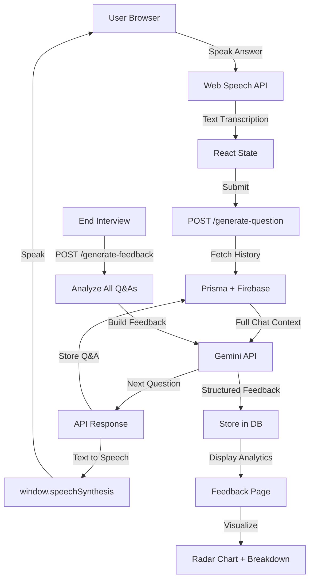
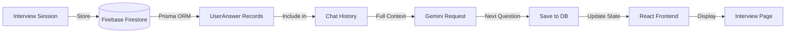
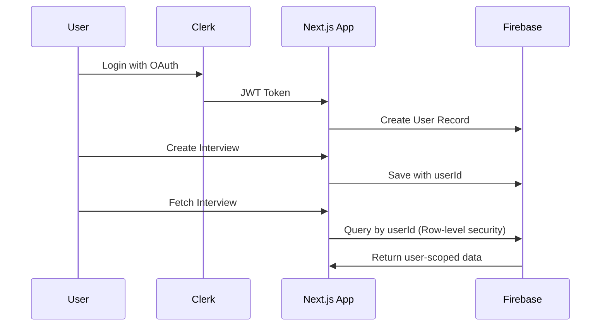
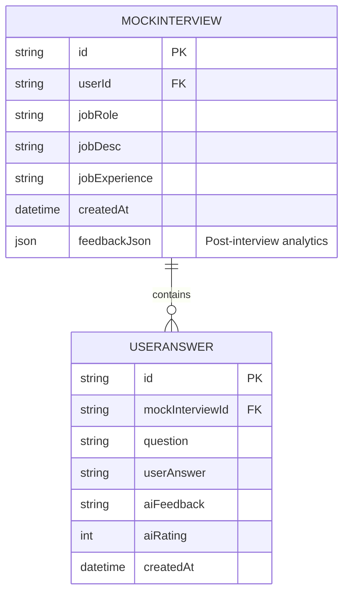

# 🎤 MockMate - AI-Powered Interview Simulator

<div align="center">

[](https://nextjs.org)
[](https://react.dev)
[](https://www.typescriptlang.org)
[](https://prisma.io)
[](https://mongodb.com)
[](LICENSE)

**Transform Your Interview Skills with AI-Powered Practice Sessions**

</div>

---

## 📋 Overview

MockMate is a comprehensive AI-powered interview simulation platform that helps developers practice and perfect their technical interview skills. Powered by Google Gemini AI, MockMate generates context-aware questions, evaluates responses in real-time, and delivers detailed performance analytics with actionable feedback.

**Key Benefits:**
- 🎯 Practice realistic, role-specific interview scenarios
- 🤖 Intelligent AI interviewer that adapts to your experience level
- 🎥 Webcam & voice integration for immersive practice
- 📊 Detailed post-interview analytics and performance insights
- 🔐 Secure, user-scoped interview data persistence
- ✅ Browser-native voice input/output (no additional costs)

---

## 🛠️ Tech Stack

### Frontend & Backend
| Technology | Purpose | Version |
|-----------|---------|---------|
|  | Full-stack React framework | 16.1.6 |
|  | UI library | 19.2.3 |
|  | Type-safe JavaScript | 5.x |
|  | Styling | 4.x |

### Database & ORM
| Technology | Purpose | Version |
|-----------|---------|---------|
|  | Firestore database | 12.9 |
|  | Type-safe ORM | 6.19.2 |

### AI & Voice
| Technology | Purpose |
|-----------|---------|
|  | AI interview engine (Gemini 1.5 Flash) |
|  | Speech-to-text & text-to-speech |
|  | Voice input wrapper |

### Authentication & UI
| Technology | Purpose | Version |
|-----------|---------|---------|
|  | Authentication | 6.38.3 |
|  | UI components | - |
|  | Data visualization | 3.7.0 |

### Deployment
| Technology | Purpose |
|-----------|---------|
|  | Serverless deployment |

---

## ✨ Core Features

### 🎙️ Intelligent Interview Engine
- **Dynamic Question Generation**: AI generates context-aware follow-up questions based on your role and experience
- **Multi-turn Conversations**: Maintains conversation history for natural interview flow
- **State Management**: Full chat history preservation using Prisma & Firebase

### 📹 Immersive Practice Environment
- **Real-time Voice Input**: Speak your answers using browser's Web Speech API
- **AI Voice Feedback**: AI responses spoken aloud automatically
- **Webcam Integration**: Optional video for realistic interview simulation
- **Sound Wave Animation**: Visual feedback during voice recording

### 📊 Advanced Analytics
- **Radar Chart**: Multi-dimensional performance visualization
- **Per-Question Breakdown**: Detailed feedback for each answer
- **Overall Score**: Aggregated performance metrics
- **AI-Generated Insights**: Specific improvement suggestions

### 🔐 Enterprise-Grade Security
- **Clerk Authentication**: Secure user authentication with OAuth support
- **Row-Level Security**: User-scoped data access via Prisma relations
- **Protected Routes**: API and page-level authorization
- **Encrypted Session Storage**: Safe interview data persistence

---

## 📁 Project Structure

```
mockmate/
├── 📄 app/                          # Next.js App Router
│   ├── (auth)/                      # Auth routes (sign-in, sign-up)
│   ├── (main)/                      # Main app routes
│   │   ├── dashboard/               # Interview selection & history
│   │   ├── interview/[interviewId]/ # Live interview page
│   │   │   └── feedback/            # Post-interview analytics
│   │   ├── settings/                # User settings
│   │   └── user-dashboard/          # User profile & stats
│   ├── api/                         # Backend API routes
│   │   ├── interview/
│   │   │   ├── create/              # POST: Create new interview
│   │   │   ├── list/                # GET: List user interviews
│   │   │   ├── [interviewId]/       # GET/DELETE interview
│   │   │   │   └── end/             # POST: End interview session
│   │   ├── generate-question/       # POST: AI question generation
│   │   └── generate-feedback/       # POST: AI feedback analysis
│   ├── layout.tsx                   # Root layout
│   └── page.tsx                     # Landing page
│
├── 📦 components/                   # Reusable React components
│   ├── feedback/
│   │   ├── QuestionAccordion.tsx    # Q&A display component
│   │   ├── RadarChartComponent.tsx  # Performance visualization
│   │   └── ScoreCircle.tsx          # Score display
│   ├── interview/
│   │   ├── MicButton.tsx            # Voice recording control
│   │   ├── QuestionDisplay.tsx      # Current question display
│   │   ├── SoundWaveAnimation.tsx   # Audio visualization
│   │   └── WebcamView.tsx           # Video stream display
│   ├── ui/                          # Shadcn/UI base components
│   ├── Footer.tsx                   # App footer
│   └── Navbar.tsx                   # Navigation header
│
├── 🪝 hooks/                        # Custom React hooks
│   └── useSpeechInput.ts            # Voice input management hook
│
├── 📚 lib/                          # Utility & service modules
│   ├── gemini.ts                    # Gemini API integration
│   ├── prisma.ts                    # Prisma client instance
│   ├── prompts.ts                   # AI system prompts
│   ├── tts.ts                       # Text-to-speech service
│   └── utils.ts                     # Helper utilities
│
├── 🗄️ prisma/                       # Database schema
│   └── schema.prisma                # Prisma data models
│
├── 📋 Configuration Files
│   ├── next.config.ts               # Next.js configuration
│   ├── tsconfig.json                # TypeScript configuration
│   ├── tailwind.config.mjs          # Tailwind CSS config
│   ├── postcss.config.mjs           # PostCSS configuration
│   ├── eslint.config.mjs            # ESLint rules
│   └── package.json                 # Dependencies & scripts
│
└── 📄 Other Files
    ├── README.md                    # Project documentation
    ├── MockMate_Blueprint.json      # Detailed architecture docs
    ├── next-env.d.ts                # Next.js type definitions
    └── components.json              # Component registry
```

---

## 🔌 API Documentation

### Interview Management

#### **POST** `/api/interview/create`
Create a new mock interview session.

**Request:**
```json
{
  "jobRole": "Full Stack Developer",
  "jobDesc": "5+ years experience with React and Node.js...",
  "jobExperience": "5 years"
}
```

**Response:**
```json
{
  "interviewId": "uuid-string"
}
```

---

#### **GET** `/api/interview/list`
Fetch all interviews for the authenticated user.

**Response:**
```json
{
  "interviews": [
    {
      "id": "uuid",
      "jobRole": "Full Stack Developer",
      "createdAt": "2024-05-28T10:30:00Z",
      "messages": [...],
      "feedbackJson": "{...}"
    }
  ]
}
```

---

#### **GET** `/api/interview/[interviewId]`
Fetch details of a specific interview with full chat history.

**Response:**
```json
{
  "interview": {
    "id": "uuid",
    "jobRole": "Full Stack Developer",
    "jobDesc": "...",
    "jobExperience": "5 years",
    "messages": [
      {
        "id": "uuid",
        "question": "Tell me about your experience with React",
        "userAnswer": "I have 5 years of experience...",
        "aiFeedback": "Good answer, but consider mentioning...",
        "aiRating": 8
      }
    ]
  }
}
```

---

#### **DELETE** `/api/interview/[interviewId]`
Delete an interview session (user-authorized).

**Response:**
```json
{
  "success": true,
  "message": "Interview deleted successfully"
}
```

---

#### **POST** `/api/interview/[interviewId]/end`
Explicitly end an interview session.

**Request:**
```json
{
  "interviewId": "uuid"
}
```

**Response:**
```json
{
  "success": true,
  "message": "Interview ended"
}
```

---

### AI Question & Feedback Generation

#### **POST** `/api/generate-question`
Generate the next interview question based on conversation history.

**Request:**
```json
{
  "interviewId": "uuid",
  "userAnswer": "I used React to build a real-time dashboard..."
}
```

**Response:**
```json
{
  "question": "That's interesting. Can you explain how you handled state management in that project?",
  "questionCount": 2
}
```

---

#### **POST** `/api/generate-feedback`
Generate comprehensive post-interview feedback and analytics.

**Request:**
```json
{
  "interviewId": "uuid"
}
```

**Response:**
```json
{
  "feedback": {
    "overallScore": 7.5,
    "strengths": ["Clear communication", "Good technical knowledge"],
    "improvements": ["Could provide more specific examples", "Speak more confidently"],
    "questionBreakdown": [
      {
        "question": "Tell me about your experience...",
        "rating": 8,
        "feedback": "Excellent answer..."
      }
    ],
    "radarChartData": {
      "communication": 7,
      "technicalKnowledge": 8,
      "problemSolving": 6,
      "confidence": 7
    }
  }
}
```

---

## 🏗️ System Architecture

### Data Flow Diagram



### State Management Architecture



### Authentication & Authorization Flow



---

## 📊 Database Schema

### Entity Relationship Diagram



### Prisma Models

**MockInterview:**
- Represents a single interview session
- Stores job context (role, description, experience)
- Maintains one-to-many relationship with UserAnswer
- Caches post-interview feedback JSON

**UserAnswer:**
- Stores individual Q&A exchanges
- Includes AI feedback and ratings
- Ordered by createdAt for conversation history
- Essential for maintaining chat context for Gemini API calls

---

## 🚀 Getting Started

### Prerequisites
- **Node.js** >= 18
- **npm** or **yarn** package manager
- Firebase account (Firestore database)
- Google Gemini API key
- Clerk authentication keys

### Installation

#### Step 1: Clone Repository
```bash
git clone https://github.com/yourusername/mockmate.git
cd mockmate
```

#### Step 2: Install Dependencies
```bash
npm install
# or
yarn install
```

#### Step 3: Setup Environment Variables
Create a `.env.local` file in the root directory:

```env
# Clerk Authentication
NEXT_PUBLIC_CLERK_PUBLISHABLE_KEY=your_clerk_key
CLERK_SECRET_KEY=your_clerk_secret

# Google Gemini AI
NEXT_PUBLIC_GEMINI_API_KEY=your_gemini_api_key

# Firebase Configuration
NEXT_PUBLIC_FIREBASE_API_KEY=your_firebase_api_key
NEXT_PUBLIC_FIREBASE_AUTH_DOMAIN=your_firebase_auth_domain
NEXT_PUBLIC_FIREBASE_PROJECT_ID=your_firebase_project_id
NEXT_PUBLIC_FIREBASE_STORAGE_BUCKET=your_firebase_storage_bucket
NEXT_PUBLIC_FIREBASE_MESSAGING_SENDER_ID=your_firebase_messaging_sender_id
NEXT_PUBLIC_FIREBASE_APP_ID=your_firebase_app_id

# Database (Firebase Firestore - via Prisma)
DATABASE_URL="firestore://your-firebase-project"
```

#### Step 4: Setup Prisma
```bash
# Generate Prisma client
npx prisma generate

# (Optional) Push schema to database
npx prisma db push
```

#### Step 5: Run Development Server
```bash
npm run dev
# or
yarn dev
```

Open [http://localhost:3000](http://localhost:3000) in your browser.

---

## 💻 Usage Guide

### Creating Your First Interview

1. **Sign Up/Login**
   - Navigate to `/auth/sign-up`
   - Create account with email or Google OAuth

2. **Create Interview Session**
   - Go to Dashboard (`/dashboard`)
   - Click "New Interview"
   - Fill in details:
     - **Job Role**: Position you're interviewing for
     - **Job Description**: Copy job posting description
     - **Experience Level**: Years of relevant experience

3. **Practice Interview**
   - Navigate to `/interview/[interviewId]`
   - Allow microphone and camera permissions
   - Read the initial question
   - Click the mic button and speak your answer
   - Submit to receive next question
   - Repeat until interview ends (typically 5 questions)

4. **Review Feedback**
   - After interview ends, view `/interview/[interviewId]/feedback`
   - Analyze:
     - Overall score
     - Radar chart visualization
     - Per-question ratings and feedback
     - Actionable improvement suggestions

### Best Practices

- **Prepare Beforehand**: Have job description ready
- **Treat Seriously**: Practice as if it's a real interview
- **Multiple Sessions**: Conduct multiple practice rounds for same role
- **Study Feedback**: Focus on low-scoring areas
- **Track Progress**: Monitor improvements across sessions

---

## 🔧 Development & Customization

### Modifying AI System Prompts
Edit `lib/prompts.ts` to customize:
- Interview personality and tone
- Question difficulty level
- Feedback depth and specificity

### Adding New UI Components
Use Shadcn/UI to add components:
```bash
npx shadcn-ui@latest add [component-name]
```

### Extending Analytics
Modify `components/feedback/RadarChartComponent.tsx` to:
- Add more evaluation dimensions
- Change visualization type
- Customize metrics calculation

### Database Changes
1. Modify `prisma/schema.prisma`
2. Run: `npx prisma db push`
3. Update API routes accordingly

---

## 🧪 Testing

```bash
# Run linting
npm run lint

# Build for production
npm run build

# Start production server
npm start
```

---

## 🚀 Deployment

### Deploy on Vercel (Recommended)

1. **Push to GitHub**
```bash
git push origin main
```

2. **Connect to Vercel**
   - Go to [vercel.com](https://vercel.com)
   - Click "New Project"
   - Select your repository
   - Add environment variables
   - Deploy

3. **Post-Deployment**
   - Update Clerk OAuth URLs
   - Update Firebase CORS settings
   - Test all features in production

### Alternative Deployment Options
- **Docker**: Create Dockerfile and deploy to any container registry
- **Self-Hosted**: Deploy using PM2 or systemd on any server
- **Netlify**: Deploy frontend separately with serverless functions

---

## 🐛 Known Limitations & Future Improvements

### Current Limitations
- ⚠️ **Browser Voice Limitations**: Web Speech API availability varies by browser (best on Chrome/Edge)
- ⚠️ **Firestore Costs**: Free tier sufficient for small user base; scale with Blaze pricing
- ⚠️ **Gemini Rate Limits**: Free tier has quotas; implement caching for production
- ⚠️ **Single Question Type**: Currently text-based; no coding problem integration
- ⚠️ **Manual Question Count**: Interview duration fixed at 5 questions
- ⚠️ **No Resume Upload**: Job context from manual pasting only

### Planned Improvements 🚀

**Phase 1 (Q3 2024)**
- [ ] Coding challenge integration (LeetCode-style problems)
- [ ] Custom interview templates and question banks
- [ ] Interview difficulty scoring algorithm
- [ ] Advanced analytics with historical trend analysis
- [ ] Export interview transcripts as PDF

**Phase 2 (Q4 2024)**
- [ ] Multi-language support
- [ ] Peer comparison and benchmarking
- [ ] AI interview coach with real-time suggestions
- [ ] Video recording and playback
- [ ] Integration with job listing APIs
- [ ] LinkedIn profile auto-fill

**Phase 3 (2025)**
- [ ] Mock group interviews
- [ ] Interview question customization by hiring manager
- [ ] Machine learning-based difficulty adjustment
- [ ] Mobile app (React Native)
- [ ] Enterprise team subscriptions
- [ ] Industry-specific question banks (FAANG, Startups, etc.)

**Technical Debt**
- [ ] Implement comprehensive error handling UI
- [ ] Add input validation and rate limiting
- [ ] Create automated test suite (Jest + RTL)
- [ ] Performance optimization (image compression, code splitting)
- [ ] Implement caching layer (Redis) for Gemini responses
- [ ] Add monitoring and analytics (Sentry, LogRocket)

---

## 🤝 Contributing

Contributions are welcome! Please follow these steps:

1. **Fork the repository**
2. **Create feature branch**: `git checkout -b feature/amazing-feature`
3. **Make changes** and test thoroughly
4. **Commit**: `git commit -m 'Add amazing feature'`
5. **Push**: `git push origin feature/amazing-feature`
6. **Open Pull Request**

### Contribution Guidelines
- Follow existing code style (TypeScript, ESLint)
- Add appropriate comments for complex logic
- Update README if adding major features
- Test changes in development environment
- Submit detailed PR description

---

## 📄 License

This project is licensed under the **MIT License** - see the [LICENSE](LICENSE) file for details.

You are free to:
- ✅ Use this project commercially
- ✅ Modify and distribute
- ✅ Use privately

With the condition of:
- 📋 Include license and copyright notice

---

## 📞 Support & Community

- 📧 **Email**: support@mockmate.dev
- 💬 **Discord**: [Join Our Community](https://discord.gg/mockmate)
- 🐛 **Issues**: [GitHub Issues](https://github.com/yourusername/mockmate/issues)
- 💡 **Discussions**: [GitHub Discussions](https://github.com/yourusername/mockmate/discussions)

---

## 🙏 Acknowledgments

- [Next.js](https://nextjs.org) - React framework
- [Prisma](https://prisma.io) - Database ORM
- [Firebase](https://firebase.google.com) - Backend services
- [Google Gemini](https://ai.google.dev) - AI engine
- [Clerk](https://clerk.com) - Authentication
- [Shadcn/UI](https://shadcn-ui.com) - UI components
- [Tailwind CSS](https://tailwindcss.com) - Styling
- [Web Speech API](https://developer.mozilla.org/en-US/docs/Web/API/Web_Speech_API) - Voice recognition

---

## 🎯 Roadmap

View detailed development roadmap in [MockMate_Blueprint.json](MockMate_Blueprint.json)

---

<div align="center">

**Made with ❤️ by the MockMate Team**

⭐ Star us on GitHub if you find this helpful!

[Report Bug](https://github.com/yourusername/mockmate/issues) · [Request Feature](https://github.com/yourusername/mockmate/discussions) · [View Docs](MockMate_Blueprint.json)

</div>
